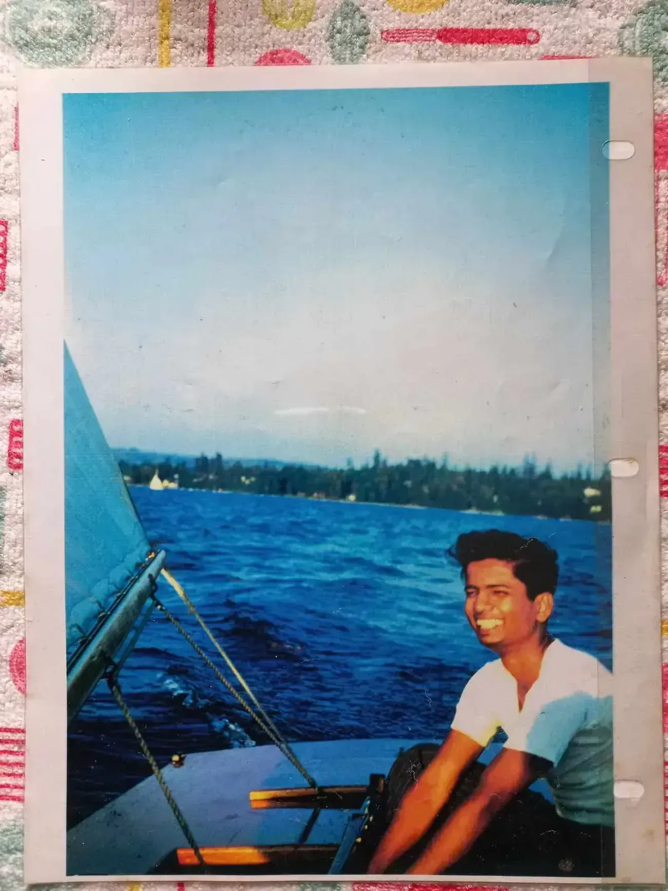
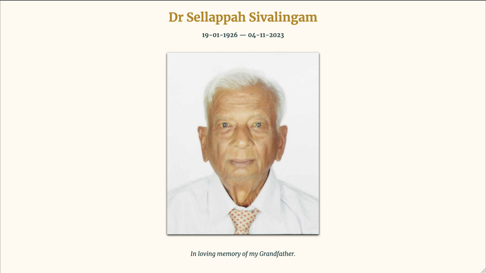

On the 4th of November, my 97-year-old (paternal) grandfather passed away.

It's been 20 years since we experienced death in our family, with my material grandparents passing away in close chronology to one another when I was roughly ten years old (I am thirty now).

My father wished he could be there for his father’s last days. He was actually due to make a trip later this month.

My fondest memory with my grandfather was our discussiong around the [Bhagavad Gita](https://en.wikipedia.org/wiki/Bhagavad_Gita). It was these conversations that shaped my present-day thinking: life is about duty and to perform that duty very well.

## The Man Himself

My Grandfather had an interesting past and present. He had worked as a teacher, then for the United Nations fisheries. If I had to describe my Grandfather, one thought that would come to mind is that he was blunt and didn’t show a lot of emotion, but he was full of love and affection which can in a very traditional male-esque way.

He contributed a lot to his surrounding community during his retirement. He was a philanthropist, supporting many causes centring around war victims in Sri Lanka. Those included children who were made orphans as well as women who were made widows. He did this by creating opportunities for education and vocation — supporting tutors for children, and establishing a sewing school as some examples.

In the days following the funeral ceremony, I had a good opportunity to hang out with my cousins where we explored Colombo. We made a pack to not let time slip without seeing each other. **What I learnt from my Grandfather's passing is that life is short, and it’s important to make time for things that matter most, like seeing family despite geographic distance**.

## The Funeral

Obviously, the family and I made the trip to Sri Lanka, where my grandfather had lives for bulk of his retired life.

Despite the sombreness of death, a positive was seeing my extended family.

Most of whom reside in the United States, and this funeral was the first time we were all together in 25 years (the last time was for my aunt’s wedding — I was 5 years old!)

Since I don't have any siblings, my cousins are the closest I get to having brothers and sisters.

We landed on Monday. Tuesday was wake. Wednesday was the funeral and cremation.

During both the wake and funeral, it was incredible to see the variety of people who came to pay their respects. And impressive to see how rich our culture is with all the customs and ritual involved.

## A Small Tribute

A small webpage ([app](https://appahappah.shivan.xyz)) / [code](https://github.com/shivan-s/appahappah) for my grandfather.

Thank you for reading.
