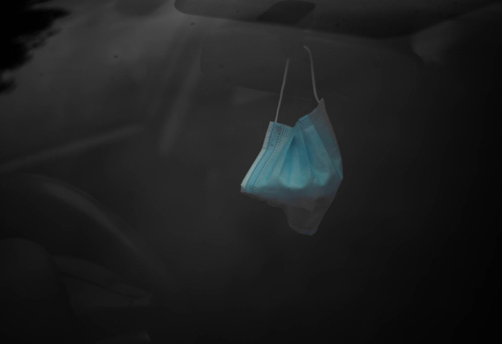

+++
author = "Shivan Sivakumaran"
title = "My Finances and Plans for 2022"
date = "2022-01-01"
description = "Time to get transparent."
categories = ["Life"]
tags = ["finances", "YouTube", "dreams", "aspirations"]
draft = false
showToc = true
showPowerBy = false
+++

Time to be transparent. I realise my reality is another person's dream. And my dreams is another's reality. I want to talk about my finances leading up to this short career sabbatical and the plans going forward.

Before we continue, I want to make some points clear. You can read this and laugh; you can read this and get jealous; you can read this and think I’m lying; or you can read this and be inspired or offer advice. I’m hoping for the latter, but the choice is yours.

The numbers I’m going to mention are round figures (but it's pretty damn close), and it will all be in New Zealand Dollars.

## What was I leaving behind?

What events and decisions lead to me moving back home to Palmerston North after a decade away?

Five years in Auckland and the last six years in Christchurch was enough.

About April of 2021, it was just Bruno and me in the house. Out of the seven days I had during the week, five were spent heading to a workplace, moving me further and further away from my dreams. The last two were spent trying to find an escape via writing and coding.

Instead of getting through hardship alone, I slowly lost my sanity. It became daily conversations with my parents. “Help, what do I do?”

Finally, after weeks and weeks of contemplation, a decision was made to sell, resign, and move back. Then, have a break and work less.

So, what was I leaving behind?

My job. A house.

In my previous jobs as a private practice and low vision optometrist, I was earning $96,000 per year (I was on salary, and I did get benefits like my optometry registration).

What about the house?

Luckily the house was sold for more than what it was purchased. In the end, I stopped work in November in 2021, the same time the house settled, and I made a move back to Palmerston North.

After the house sale, I had about $110,000 in cash — the majority of this will be home equity, profit from the house sale for myself, and some emergency money I had lying around.

## I’m home. Now, what?

For the first time in a long time, I could tangibly see that I was in the green. I had no major debts apart from a student loan, which started at $75,000 and is now down to $27,000. I had no dependants apart from Bruno. I was moving into my parent's home. I wasn't paying for rent or a looming mortgage. I’m single, and every decision I can make is my decision.

For me, I’m not going to find myself in a situation like this ever again.

So, what do I do with $110,000? (I think it is also important to note that I had depleted my KiwiSaver for the first home purchase and only have about $5,000 in index funds and $2,000 in cryptocurrency).

Do I pay off the student loan? As we may know, student loans in New Zealand are interest-free as long as you stay in the country, and I have no intention of leaving the country in the immediate future. So, let inflation give a helping hand and pay off that student loan as slow as possible.

An investment property or another property is out of the cards. At least in my head, I don’t have enough for a deposit and have no income to service a loan. On top of that, I don’t want to entrap myself in a job to secure a home loan. That’s the initial mess I was in.

If I was following the financial pathway that I created a while ago, there is the temptation to dump most of the money into an index fund earning a measly 8% return at best and putting some into highly speculative cryptocurrency. Only a year ago, I thought these were the best discoveries since sliced bread. Boy! Am I a hypocrite?

## I’ve become an optimistic

Index funds, cryptocurrency, another house, could work but they come with an opportunity cost. The cost is less liquid money.

Why did I move back to Palmerston North? Why did I leave home and a well-paying job? There were multiple factors. I was burnt out. I was alone. I was moving away from the person I wanted to be. My body was living, but my soul was slowly dying.

What does this have to do with what to invest money into?

I think it’s time to make an announcement. I’ve become a _little_ deluded.

Wait! I shouldn’t say that about myself, instead I’ve become optimistic again.

The slow death I was experiencing comes a light at the end of the tunnel. I’ve started to dream again. I’ve started to believe in myself again.

Killing my student loan, purchasing an investment property, dumping money in index funds and crypto is voting against my ability. It’s admitting that I don’t believe in my skills. I rely on someone else to become wealthy.

When I say these options have opportunity cost, it’s really lost opportunity in myself.

Earlier, I mentioned that I would never have this opportunity again. I’m not working at the moment, so I have time. I have no big expenses. Or a big loan that needs to be paid back immediately. I have cash available.

Now, I have a dream. I have huge goals. And it doesn’t involve sitting in a dark room, saying one and two, five days a week in return for two, for the rest of my life, while waiting for my index funds to mature and praying cryptocurrency becomes adopted into society.

It's time to take a leap of faith, to put the chips on myself.

I have talked about technology creating a one-to-many relationship, which isn’t limited by simple geography. I want to become an entrepreneur. I want to become a content creator. I want to have a message and broadcast that to the entire world. I want to create, write and inspire. I want to be that voice I wish I had when I was younger. I want to learn. I want to utilise my skills to their full potential.

I’ve been playing around with writing in a blog and newsletter, but it’s time for the first big investment to start a YouTube channel.

## Where did the money go?

Of the $110,000, I put $50,000 into a savings account. This will be my 'emergency’ fund.

What is left is being spent on staying alive, building a YouTube channel, investing in myself, building my skills.

The first exchange was in an online course. Then a camera, lens, studio gear, a laptop.

The biggest expense you might think of is the camera or the laptop. The cost breakdown will surprise you:

- Sony A6400 and Sigma 16mm f1.8 — $1900
- Macbook 14” M1 Pro — $3300
- Part-Time YouTuber Academy Online Course — $2000 + $5000 = $7000

You might say, your smartphone, a free editing app, and online resources are enough to create YouTube content. And they are.

The equipment is a deliberate spend to have good production value. And for the course, which makes up the bulk of the expense (believe it or not), never undervalue education and community. I should add that I purchased a lower tier at $2000; I liked the course so much that I upgraded to a higher tier.

Education is undervalued. YouTube is a lonely road. Your family, friends and strangers won’t support you.

It’s you, the script, and the camera. It doesn’t get more lonely than that (in the beginning, anyway). When you are employed, you are obliged to turn up; you have work colleagues. If you work as an optometrist, you see different people every day. Content creation is freedom, but that doesn’t mean the content makes itself. You need to stay on the beaten track, which is made easier with people walking alongside you. And that is the most valuable thing this course provides.

## Why am I doing this?

That is an excellent question. I ask myself the same thing from time to time.

I could return to a life of a dark room, one and two, five days a week, in return for two (a 60% loss, by the way).

But, as I alluded to before, I have a big dream.

My dreams are to make my parent's mortgage-free and not worry about the bills.

To buy a house mortgage-free.

To have an hourly rate of $10,000.

To be able to change people's lives.

To inspire.

To promote those who may not have a voice.

**I want to promote wellness in optometry, health professions and all of work**.

To travel the world.

To tip extravagantly.

To treat my friends to a nice brunch out.

I have no defined plan. From time to time, I have doubts that this will work. But that is okay. The act is trying. Trying is direction closer to my dreams.

Think about how I can, rather than how I can’t.

What if it fails? What if it goes well?

The first step is believing in myself, almost to a delusional level.

I go onto social media: “congratulations” is only reserved for home buying, engagements, marriage, and having a baby — the conventional way of life.

**Not one soul will praise you for taking the unconventional path. You must do it yourself and find people in the same vessel**.

Optometry offers security now. It’s the patronage to building a pathway for my dreams. But the job alone won’t provide those dreams. Index funds won’t. Speculating on the cryptocurrency won’t either. The lottery isn’t for me.

That is where building something, creating something useful give both leverage and control.

On top of that, I need to look after my health. I’m back at the gym. I’m meditating. I’m journaling. I’m eating healthy (thanks, Amma [Mother in Tamil]). I want to spend less time on social media and more time up-skilling, thinking and reading. I know I can do this, but it won’t be easy.

But, won’t these big dreams make you sad if you fail? Not at all. Having these near delusional thoughts is the reason to get out of bed. We don’t live life to settle for mediocrity. We are on this planet once, as far as I know. Every day working towards the dream is a good day; a day that isn’t is death.

The worst part is letting dreams die because you never tried.

## What now?

At the moment, I’m jobless, living at home, scrounging off my parents, and making no money (yet). As I said, I’m currently living off savings, and my expenses are relatively low. I’m fortunate to be stepping into a part-time role and in a less stressful environment. I will be working 24 hours instead of 40 hours for a marginally higher hourly rate of $50 (yes, I’m a wage worker, which is no less than a title of a “salaried” person).

The cash I have now is the best-kept liquid. There is a temptation to stuff it into a managed fund or put it somewhere “safe”.

To put it somewhere safe... The scary thing is this is my life savings. They are just numbers to you. But to me, it’s more than digits on a screen.

My life savings represent the daily ritual of attending a job that didn't provide fulfillment. Dealing with office politics. It represented getting sworn at by my boss. Pushing through every customer's bad review and complaint. Putting on a smile and remaining stoic, while the “customer is always right”. Having my head held high above subtle racist remarks. All this, my dreams remained unkept while I built another’s.

To see this slowly erode, I’ll admit, is scary. But I should be more fearful when I’m older, regretting what could have been.

## Conclusion

You know my financial situation coming up to this point in my life. You know my dreams. You know my goals and plans for the future.

Now, what do you think? Did this inspire you? Are you in a similar situation? Am I shouting success without being successful? Am I crazy? Let me know down below.

Crazy or not, the journey begins.
