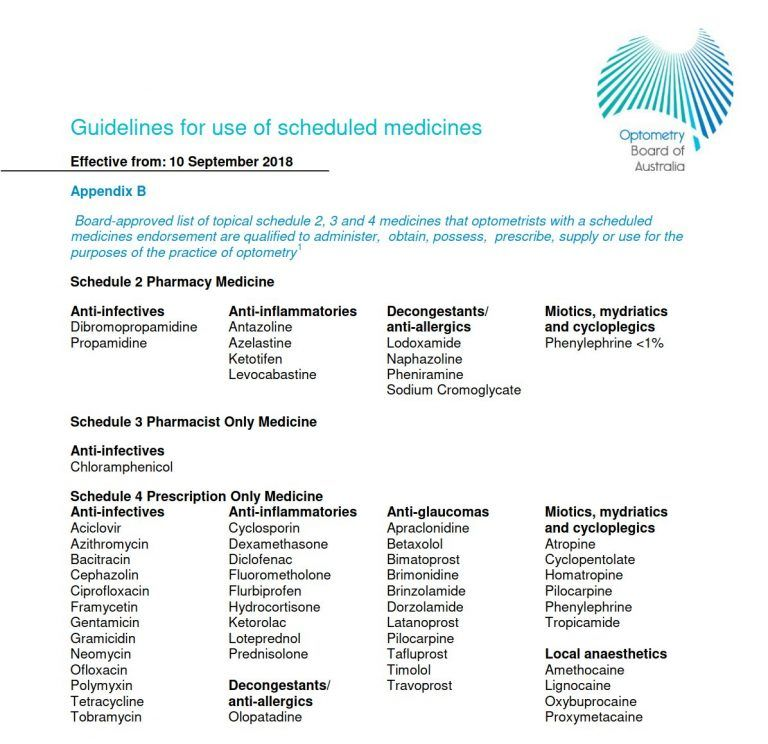

When you have colourful friends, an occupation like mine, combined with a late night dinner conversation, the question is inevitable: can **Cannabis** (**Taru rauhae**) be used as a form of treatment for **glaucoma** (**papahewa**)?

Below is a video that summaries the topic:



Cannabis is one of the most controversial plants in human history. It is cultivated, dealt, and consumed, sometimes illegally (Ashton, 2001). There is a strong debate for cannabis’s medical usage, as well as potential harm (Clark et al., 2011).

Thanks to my friends’ intrigue, I’ve been deeply researching this topic. Answering their curiosity and my own, we will dive deep into Cannabis and glaucoma. We will also look at:

- a brief overview of Cannabis
- the current legal status of prescribing optometrists,
- how it works in the eye, and finally
- is it effective to use Cannabis to treat glaucoma?

*Disclaimer — this is for educational purposes only. If you have any eye issues please consult your local eye care professional.*

*As a note, I’ve written this for the public as well as eye care professionals. So there will be over-laboured points and potentially confusing ideas. I wrote this with everyone in mind. You might have noticed already, but in parenthesis, I’ve included some sources. In advance, I’d like to thank you for having to deal with this, and I hope you enjoy and become more educated/refreshed (please share this with friend and family if you did). Comment below if you have anything to add.*

## Cannabis and it’s controversial history

The 2020 Cannabis referendum saw Aotearoa divided. Unlike the End of Life Choice referendum, where almost two-thirds of Kiwis voted in support of the bill, the proposed Cannabis legalisation bill lost only by a slim margin. 48.4% voting supporting legalisation and 50.7% voting against (New Zealand Gazette Te Kāhiti o Aotearoa, 2020). Already, we can see Cannabis grabs the spotlight, splitting the nation.

Described as a group of plants (such as Cannabis sativa and Cannabis indica), the Cannabis extracts have been used for thousands of years. In ancient China, India and Egypt, they have been used in various treatments, including pain during childbirth, malaria, and constipation. Fast-forwarding to the 1970s, the United Kingdom, the United States and Canada banished Cannabis to the realm of crime and illicit substance use due to its psychotropic nature (Amin & Ali, 2019).

Recently, there is a resurgence in Cannabis’s therapeutic benefits. Cannabis is proven effective in treating chronic pain and reducing nausea and vomiting caused by chemotherapy (The Health Effects of Cannabis and Cannabinoids, 2017). And, what will be relevant to us is its ability to possibly treat glaucoma by lowering eye pressure (Hepler & Frank, 1971).

Despite losing on the referendum, recent amendments to New Zealand legislation have lead to better access and production of Cannabis for medicinal purposes (NZ Drug Foundation Te Tūāpapa Tarukino o Aotearoa, n.d.). With this increased attention, let’s look deeper into Cannabis.

## What is Cannabis?

The Cannabis plants contain over 400 different compounds. 60 of these compounds, called cannabinoids, have a psychoactive effect (specifically, **phytocannabinoids**, **phyto-** being associated with plant). There are two cannabinoids, which are particularly interest. These naturally occurring cannabinoids provide the strongest effects on the human body, and they are:

1. Δ⁹-Tetrahydrocannabinol (Δ⁹-THC)
2. Cannabidiol (CBD)

Δ⁹-THC is the main psychoactive component of Cannabis. It’s what provides the ‘high’ in recreational use (Ashton, 2001). CBD is thought to provide the medical component of Cannabis (Black et al., 2019), even dampening the unwanted effects of THC.

Consumed in various ways, Cannabis can be inhaled by burning plant matter in ‘joints’ or ‘pipes’. It can also be eaten by baking into cakes and cookies (Ashton, 2001).

Cannabinoids interact with the body’s own Endocannabinoid system which is what we will explore next.

## The Endocannabinoid system

The **Endocannabinoid system** (ECS), present in the vertebrates (living beings with a spine), mammals and humans, is responsible for many functions. These range from appetite to the heart, fertility to immune functions, and memory to pain. Loss of normal functioning precipitates into disease (Battista et al., 2012).

The ECS comprises endocannabinoids, which are neurotransmitters (chemical signals between nerve cells) and receptors (special proteins that receive signals).

They main two endocannabinoids are:

- N-arachidonoyl-ethanolamine (anandamide or AEA), and
- 2-arachidonoylglycerol (2-AG).

The two main receptors for endocannabinoids are found in the nervous system cells (such as the brain and even the eye). They are:

- Cannabinoid Receptor 1 (CB1), and
- Cannabinoid Receptor 2 (CB2).

Other receptors are also: GPR18 and GPR119 (Straiker, 2019).

Endocannabinoids acts on these receptors to produce these intended human functions. Phytocannabinoids and synthetics cannabinoids can also activate these receptors.

## The legal status of prescribing in Aotearoa (and Australia, United States and the United Kingdom)

Now we know what Cannabis is, let’s take a step back and look at the legality of Cannabis use.

In Aotearoa, despite still being illegal to possess for recreational use, Cannabis is allowed for medical purposes. This requires a prescription from a doctor (Ministry of Health Mānatu Hauora, 2021). In Australia, this is similar, although there might be some variation at the state level (Therapeutic Goods Administration, 2017). The UK marches to the same rhythm, acceptable for medical use only, granted with doctor’s prescription (UK Legislation, 2018).

In the US, Cannabis is treated differently for both recreational and medicinal use. Cannabis is illegal for all uses at the federal level. On the other hand, state-level laws supersede this blanket ban. States like California allow controlled recreational and medical use (National Conference of State Legislatures, 2019).

But, what about the role of optometrists as medicine prescribers?

First we need to look at:

- prescribing, and
- optometrists and required additional training.

In Aotearoa, authorised prescribers are described as the only individuals who can prescribe medicines. Authorised prescribers include medical practitioners (i.e. doctors), nurse practitioners (nurses with additional, high-skill training) and also optometrist (New Zealand Parliamentary Counsel Office Te Tari Tohutohu Pāremata, 2017).

Because optometrists are considered authorised prescribers, they can prescribe medicine within their scope (i.e. treating eye problems). However, there is a condition to this.

Optometrists, in Aotearoa, are governed by the Optometrists and Dispensing Optician Board Te Poari o ngā Kaimātai Whatu me ngā Kaiwahakarato Mōhiti (ODOB). According to the ODOB, optometrists are required to have an authorised scope to prescribe medicine. Furthermore, an optometrist must fulfil additional prerequisites to prescribe glaucoma medication. This additional glaucoma endorsement involves additional training, such as completing extra certification or performing twenty hours of observation under a glaucoma-specialised practitioner (Optometrists and Dispensing Opticians Board Te Poari o ngā Kaimātai Whatu me ngā Kaiwahakarato Mōhiti, n.d.).

This means an optometrist without an endorsement can not prescribe medicine, or an optometrist with an endorsement can prescribe medicine but not medicine related to treating glaucoma without extra glaucoma credentialing.

This is similar for optometrists in Australia. The Optometry Board of Australia conducts affairs for Australian optometrists. Board-approved optometrist must have a medicines endorsement to prescribe medication. This includes glaucoma. What is prescribed is limited to a list of medications (Optometry Board of Australia AHPRA, 2019). What differs is NZ optometrists have more flexibility in what can be prescribed, so as long as it is to treat the eye. This works well if drugs change or need to be substituted.

In the UK, the General Optical Council acts as the legal representation of opticians and optometrists. To prescribe medical drops in the UK, an optometrist will need to become an independent prescriber. This often involves extra training. A particular prescribing field is chosen within this training — such as glaucoma (General Optical Council, 2015).

Finally, the United States is slightly different. Optometrists are state-certified. Extra authorisation is required to prescribe medicine. This is known prescriptive authority (National Conference of State Legislatures, 2018).

With the right credentialing, optometrists in these countries can treat glaucoma. And with glaucoma treatment, the question arises: can medicinal cannabis be used to treat glaucoma?

## How Cannabis protects against glaucoma

How does Cannabis help reduce glaucoma? In short, the exact mechanism is not very well understood. However, there are some proposed mechanisms.

Shown by Hepler and Frank in 1971, Cannabis reduces eye pressure by (Katz & Costarides, 2019):

- decrease AH production, and
- increase AH outflow through both the conventional and non-conventional pathway.

In addition to this, Cannabis displays neuroprotection by regulating (Passani et al., 2020):

- glutamate, and
- endothelin-1.

CB1 receptors are widely present throughout the tissues of the eye. The Cannabinoids of Cannabis works on multiple eye structures (Panahi et al., 2017). Cannabis causes vasodilation of blood vessels that surround the ciliary body. The ciliary body is responsible for aqueous humour (AH) production. Vasodilation is when the blood vessels expand in size, and this results in reduced blood pressure. Reduced blood pressure means less fluid leaves the vessels to produce AH. Less AH lowers eye pressure (Nucci et al., 2008).

In addition to this, Cannabinoids increase COX-2 expression. This increases the prostaglandins in the eye. Similar to using prostaglandin analogue eye drops, this activates matrix metalloproteinases resulting in increased outflow through the uveoscleral or non-conventional pathway. More outflow means less eye pressure (Nucci et al., 2008).

Cannabinoids also cause contraction of the ciliary muscles. Not only does this result in a slightly dilated pupil. This results in the drainage angle opening — exposing the trabecular meshwork — and improving outflow, again reducing eye pressure (Lograno & Romano, 2004).

On top of directly influencing AH production and outflow, Cannabinoids display neuroprotection by modulating neurotransmitters and signalling molecules. One of these is glutamate. High glutamate levels are toxic (Zhou & Danbolt, 2014) to retinal ganglion cells (RGCs). This is because glutamate results in nitric oxide production, which causes free radicals to increase. Too many free radical can damage cell components leading to cell death. RGCs are responsible for sending visual information from the eye to the brain. Loss of these cells results in glaucoma. CB1 activation by Cannabinoids results in less glutamate release, and therefore less RGC death (Passani et al., 2020).

Also, Cannabinoids inhibits **endothelin-1** — a signalling molecule. Endothelin-1 causes constriction of blood vessels, and hence reduced blood flow. Individuals with normal tension glaucoma have higher endothelin-1 levels. Through cannabinoids’ ability to reduce endothelin-1, this helps improve blood flow to the optic nerve head — the cable that connects the eye to the brain. This means the RGCs are able to receive the nourishment they need to survive (Passani et al., 2020).

These are propositions for how cannabis can protect against glaucoma. Now, let’s understand how Cannabis is administered.

## Administration of Cannabis

Cannabis can be consumed in four ways:

- inhalation,
- oral,
- topically, and
- intravenously.

Hepler and Frank in 1971 is the first study to explore Cannabis for glaucoma treatment. Subjects consumed Cannabis traditionally, inhaling through a water-cooled pipe. They had their eye pressure measured before and an hour after they smoked. A drop in eye pressure was observed. Further studies replicated this finding (Hepler & Petrus, 1976; Merritt et al., 1980).

Hepler & Frank also conducted experiments with an oral formulation of Cannabis (Δ⁹-THC) and too achieved a drop in eye pressure. Synthetic Cannabis forms (e.g BW146, Dronabinol, Nabilone) did observe a reduction in eye pressure as well. However, CBD did not (Passani et al., 2020).

Like most current glaucoma medication, Cannabis has been isolated in a topical eye drop formulation. Topical eye drops are challenging. The difficulty lies in passing cannabinoids through the cornea into the eye. The cornea (or front layer of the eye) is composed of multiple layers. The first layer is the **corneal epithelium**, which allows ‘oily-like’ molecules to pass through. The layer underneath is the **corneal stroma**, and this allows ‘water-like’ molecules to pass.

Cannabinoids are fat-soluble, which means they are ‘oily-like’. Other compounds can be added to improve absorption. This is already done with current medication. For example, steroid eye drops employ **cyclodextrin** to pass through the cornea into the eye (Katz & Costarides, 2019).

Unfortunately, cyclodextrin does not work well with cannabinoids. Investigators in a study had to formulate a **prodrug** instead. A prodrug is a precursory form of the acting drug. The prodrug, with the aid of cyclodextrin, can pass into the eye. Once the prodrug enters the eye, it can transform into its active form, Δ⁹-THC. This did achieve a reduction in eye pressure (Adelli et al., 2017).

WIN 55212-2 is a synthetic cannabinoid also developed as a topical eye drop. This was also able to enter the eye and achieve a drop in eye pressure (Porcella et al., 2001).

Finally, an unusual treatment method for glaucoma is providing medication intravenously. However, Cooler & Gregg did find a reduction in eye pressure with intravenous Δ⁹-THC (Cooler & Gregg, 1976).

## Efficacy of Cannabis

We know the current treatment for glaucoma is reducing eye pressure. Cannabis’s has the ability to reduce eye pressure, so this sounds promising.

For all the good, now it’s time to talk about the bad.

Even though these studies observe a decrease in eye pressure, the decrease is only short-lasting. Wang & Danesh-Meyer summarises the literature very well, showing that pressure reduction due to Cannabis did not last more than 4-5 hours (Wang & Danesh-Meyer, 2020).

For example, the topical synthetic Cannabinoid WIN 55212-2 effect dissipates 2 hours after instillation (Porcella et al., 2001). Another example is the THC prodrug eye drop. Compared to an existing glaucoma medication, timolol, the THC prodrug underperformed. Timolol maintains reduced eye pressure for longer (Adelli et al., 2017).

Most medications, whether taken orally or applied as an eye drop, have unintended side effects. Entering the bloodstream, medication can interact with other bodily systems (Farkouh et al., 2016). Cannabis does the same and doesn’t go without side effects.

These side effects range from changes in mental status, reduced blood pressure, and increased heart rate. Most individuals with glaucoma are elderly and take medication to control blood pressure and heart rate. Cannabis can interfere with these medications, which can cause serious problems with their health (Wang & Danesh-Meyer, 2020).

Thanks to Cannabis’s short-acting nature, more doses of Cannabis are required to achieve the same therapeutic effect as conventional medication. This exposes individuals more to these unwanted side effects.

Despite decreasing eye pressure and providing neuroprotection potential, the side effects and its short-acting nature make Cannabis an ineffective treatment for glaucoma at present.

## Conclusion

Cannabis is a controversial topic. Still remaining illegal for recreational use in most countries, there is acceptance for use medically.

Optometrist in Aotearoa, Australia, the UK and the US can prescribe medicines to treat eye disease even glaucoma. That means optometrists may be treating glaucoma with Cannabis if it proves effective.

Numerous proposed mechanism for how Cannabis can halt glaucoma damage exists. They mainly involve reducing eye pressure and neuroprotection.

Though a reduction in eye pressure is observed, the problem is that this is short-acting compared to current medication. Additionally, Cannabis comes with many harmful side effects.

Even though Cannabis has gained notoriety for its medical status (e.g. treating chronic pain), we are yet to see Cannabis convincingly treat glaucoma at the present moment. However, this will be an interesting space to watch.

I hope you enjoyed reading this as much as I enjoyed researching and writing this. Please share this with anyone who might find this interesting. Also, hit reply if you have anything you would like to add. Please subscribe to my FREE weekly newsletter for updates.

## References

Adelli, G. R., Bhagav, P., Taskar, P., Hingorani, T., Pettaway, S., Gul, W., ElSohly, M. A., Repka, M. A., & Majumdar, S. (2017). Development of a Δ9-Tetrahydrocannabinol Amino Acid-Dicarboxylate Prodrug With Improved Ocular Bioavailability. Investigative Ophthalmology & Visual Science, 58(4), 2167. https://doi.org/10.1167/iovs.16-20757

Amin, M. R., & Ali, D. W. (2019). Pharmacology of Medical Cannabis. Advances in Experimental Medicine and Biology, 1162, 151–165. https://doi.org/10.1007/978-3-030-21737-2_8

Ashton, C. H. (2001). Pharmacology and effects of cannabis: A brief review. British Journal of Psychiatry, 178(2), 101–106. https://doi.org/10.1192/bjp.178.2.101

Battista, N., Di Tommaso, M., Bari, M., & Maccarrone, M. (2012). The endocannabinoid system: an overview. Frontiers in Behavioral Neuroscience, 6. https://doi.org/10.3389/fnbeh.2012.00009

Black, N., Stockings, E., Campbell, G., Tran, L. T., Zagic, D., Hall, W. D., Farrell, M., & Degenhardt, L. (2019). Cannabinoids for the treatment of mental disorders and symptoms of mental disorders: a systematic review and meta-analysis. The Lancet Psychiatry, 6(12). https://doi.org/10.1016/s2215-0366(19)30401-8

Blind Low Vision New Zealand. (n.d.). Blindness and Low Vision in New Zealand – Latest statistics. Blind Low Vision NZ. Retrieved March 7, 2021, from https://blindlowvision.org.nz/information/statistics-and-research/

Boston, C. S., MD, and Lucy Q. Shen, MD. (2020, May 6). Monitoring Glaucoma Progression with OCT. Www.reviewofophthalmology.com. https://www.reviewofophthalmology.com/article/monitoring-glaucoma-progression-with-oct

Clark, P. A., Capuzzi, K., & Fick, C. (2011). Medical marijuana: Medical necessity versus political agenda. Medical Science Monitor, 17(12), RA249–RA261. https://doi.org/10.12659/msm.882116

Coleman, A. L., & Miglior, S. (2008). Risk Factors for Glaucoma Onset and Progression. Survey of Ophthalmology, 53(6), S3–S10. https://doi.org/10.1016/j.survophthal.2008.08.006

Cooler, P., & Gregg, J. M. (1976). The Effect of Delta-9-Tetrahydrocannabinol on Intraocular Pressure in Humans. The Therapeutic Potential of Marihuana, 77–87. https://doi.org/10.1007/978-1-4613-4286-1_6

Farkouh, A., Frigo, P., & Czejka, M. (2016). Systemic side effects of eye drops: a pharmacokinetic perspective. Clinical Ophthalmology, Volume 10, 2433–2441. https://doi.org/10.2147/opth.s118409

General Optical Council. (2015). Independent Prescribing. General Optical Council. https://www.optical.org/en/Education/Specialty_qualifications/independent-prescribing.cfm

Glaucoma New Zealand. (n.d.). Glaucoma NZ – Glaucoma Screening. Glaucoma.org.nz. Retrieved March 13, 2021, from https://glaucoma.org.nz/About-Glaucoma/Investigations/Glaucoma-Screening.asp

Hepler, R. S., & Frank, I. R. (1971). Marihuana smoking and intraocular pressure. JAMA: The Journal of the American Medical Association, 217(10), 1392c1392. https://doi.org/10.1001/jama.217.10.1392c

Hepler, R. S., & Petrus, R. J. (1976). Experiences with Administration of Marihuana to Glaucoma Patients. The Therapeutic Potential of Marihuana, 63–75. https://doi.org/10.1007/978-1-4613-4286-1_5

Katz, J., & Costarides, A. P. (2019). Facts vs Fiction: the Role of Cannabinoids in the Treatment of Glaucoma. Current Ophthalmology Reports, 7(3), 177–181. https://doi.org/10.1007/s40135-019-00214-z

Lograno, M. D., & Romano, M. R. (2004). Cannabinoid agonists induce contractile responses through Gi/o-dependent activation of phospholipase C in the bovine ciliary muscle. European Journal of Pharmacology, 494(1), 55–62. https://doi.org/10.1016/j.ejphar.2004.04.039

Merritt, J. C., Crawford, W. J., Alexander, P. C., Anduze, A. L., & Gelbart, S. S. (1980). Effect of Marihuana on Intraocular and Blood Pressure in Glaucoma. Ophthalmology, 87(3), 222–228. https://doi.org/10.1016/s0161-6420(80)35258-5

Ministry of Health Mānatu Hauora. (2021, April 3). Medicinal Cannabis Agency – Information for health professionals. Ministry of Health NZ. https://www.health.govt.nz/our-work/regulation-health-and-disability-system/medicinal-cannabis-agency/medicinal-cannabis-agency-information-health-professionals

National Conference of State Legislatures. (2018, October 23). Optometrist Scope of Practice. Www.ncsl.org. https://www.ncsl.org/research/health/optometrist-scope-of-practice.aspx

National Conference of State Legislatures. (2019). State Medical Marijuana Laws. Ncsl.org. https://www.ncsl.org/research/health/state-medical-marijuana-laws.aspx

New Zealand Gazette Te Kāhiti o Aotearoa. (2020a, November 6). 2020 Cannabis Legalisation and Control Referendum Declaration of Official Results. New Zealand Gazette. https://gazette.govt.nz/notice/id/2020-au5131

New Zealand Gazette Te Kāhiti o Aotearoa. (2020b, November 6). 2020 End of Life Choice Referendum Declaration of Official Results – 2020-au5132 – New Zealand Gazette. Gazette.govt.nz. https://gazette.govt.nz/notice/id/2020-au5132

New Zealand Parliamentary Counsel Office Te Tari Tohutohu Pāremata. (2017, July 3). Medicines Amendment Act 2013 No 141 (as at 03 June 2017), Public Act – New Zealand Legislation. Www.legislation.govt.nz. https://www.legislation.govt.nz/act/public/2013/0141/latest/whole.html#DLM4096106

Nucci, C., Bari, M., Spanò, A., Corasaniti, M., Bagetta, G., Maccarrone, M., & Morrone, L. A. (2008). Potential roles of (endo)cannabinoids in the treatment of glaucoma: from intraocular pressure control to neuroprotection. Progress in Brain Research, 451–464. https://doi.org/10.1016/s0079-6123(08)01131-x

NZ Drug Foundation Te Tūāpapa Tarukino o Aotearoa. (n.d.). Medicinal Cannabis. NZ Drug Foundation. Retrieved March 30, 2021, from https://www.drugfoundation.org.nz/policy-and-advocacy/medicinal-cannabis/

Optometrists and Dispensing Opticians Board Te Poari o ngā Kaimātai Whatu me ngā Kaiwahakarato Mōhiti. (n.d.). Therapeutic Prescribing. ODOB. https://www.odob.health.nz/i-am-registered/therapeutic-prescribing/

Optometry Board of Australia AHPRA. (2019, October 18). Optometry Board of Australia – Board approved scheduled medicines list for endorsed optometrists. Www.optometryboard.gov.au. https://www.optometryboard.gov.au/Registration-Standards/Endorsement-for-scheduled-medicines/Board-approved-scheduled-medicines-list-for-endorsed-optometrists.aspx

Panahi, Y., Manayi, A., Nikan, M., & Vazirian, M. (2017). The arguments for and against cannabinoids application in glaucomatous retinopathy. Biomedicine & Pharmacotherapy = Biomedecine & Pharmacotherapie, 86, 620–627. https://doi.org/10.1016/j.biopha.2016.11.106

Passani, A., Posarelli, C., Sframeli, A. T., Perciballi, L., Pellegrini, M., Guidi, G., & Figus, M. (2020). Cannabinoids in Glaucoma Patients: The Never-Ending Story. Journal of Clinical Medicine, 9(12). https://doi.org/10.3390/jcm9123978

Porcella, A., Maxia, C., Gessa, G. L., & Pani, L. (2001). The synthetic cannabinoid WIN55212-2 decreases the intraocular pressure in human glaucoma resistant to conventional therapies. European Journal of Neuroscience, 13(2), 409–412. https://doi.org/10.1046/j.0953-816x.2000.01401.x

Portellos, M., Buckley, E. G., & Freedman, S. F. (1998). Topical versus oral carbonic anhydrase inhibitor therapy for pediatric glaucoma. Journal of American Association for Pediatric Ophthalmology and Strabismus, 2(1), 43–47. https://doi.org/10.1016/s1091-8531(98)90109-4

Straiker, A. (2019). What is currently known about cannabidiol and ocular pressure. Expert Review of Ophthalmology, 14(6), 259–261. https://doi.org/10.1080/17469899.2019.1698947

The Health Effects of Cannabis and Cannabinoids. (2017). National Academies Press. https://doi.org/10.17226/24625

Therapeutic Goods Administration (TGA). (2017, December 21). Guidance for the use of medicinal cannabis in Australia: Patient information. Australian Government Department of Health Therapeutic Goods Administration. https://www.tga.gov.au/publication/guidance-use-medicinal-cannabis-australia-patient-information

UK Legislation. (2018). The Misuse of Drugs (Amendments) (Cannabis and Licence Fees) (England, Wales and Scotland) Regulations 2018. Legislation.gov.uk. https://www.legislation.gov.uk/uksi/2018/1055/made

Wang, M. T. M., & Danesh-Meyer, H. V. (2020). Cannabinoids and the eye. Survey of Ophthalmology, 66(2), 327–345. https://doi.org/10.1016/j.survophthal.2020.07.002

Zhou, Y., & Danbolt, N. C. (2014). Glutamate as a neurotransmitter in the healthy brain. Journal of Neural Transmission, 121(8), 799–817. https://doi.org/10.1007/s00702-014-1180-8‌
