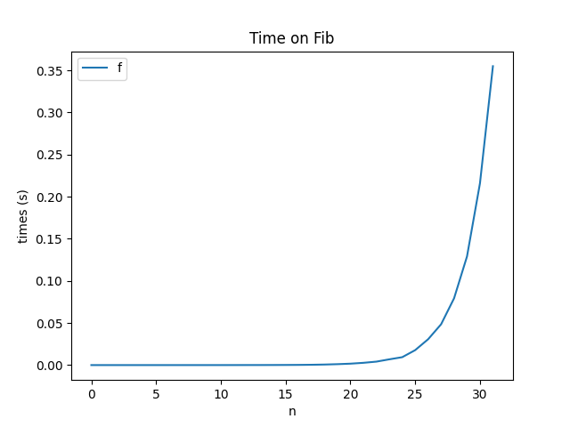
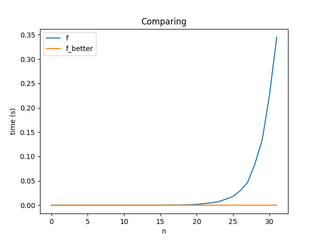

[Python](https://www.python.org) is a general-purpose programming language, excellent if you want to begin learning how to program or build a company to take over the world.

Programming is a powerful skill and Python is the easy entry point.

Without wasting much time, this post provides a zero to hundred with Python... with some tips at the end.

[Here is the source code](https://git.chch.tech/Shivan/learning_python/src/branch/main/zero_2_hundred).

Here is a video demonstration below:



## Printing and Variables

Lesson number 1 (or 0...), printing to the console. We open up the Python interpreter:

```bash
$ python

# or

$ pipenv run ipython
```

Next, we write our notorious first line of code.

```python
print("Hello World")
>>> Hello World
```

Next, we learn about commenting code.

```python
# this is a comment and will not be
# evaluated like code
```

**Variables** store values, or they point to places in memory in which these values are stored.

```python
number = 10
string = "This is a string"

print(number)
>>> 10
print(string)
>>> "This is a string"
```

We can use `f-strings` to print our code within a string, using curly braces to enclose our variable names or Python code.

```python
print(f"number: {number}, and string: {string}")
>>> "number: 10, and string: This is a string"
```

Variables aren't all the same. They have types. For example, number is an `integer` and string is a collection of characters, called a `string`.

```python
print(f"{type(number} and {type(string)}")
>>> "<class 'int'> and <class 'str'>"
```

## Functions

If we have code we have to write, again and again, it's good practice to not repeat ourselves. Instead of repeating ourselves, we put this code in a **function** and call this function. Let's create a function for the [Fibonacci sequence](https://en.wikipedia.org/wiki/Fibonacci_number), where we pass a number, `n` and this will give the `nth` sequence.

```python
# the fibonacci sequence
# 0, 1, 1, 2, 3, 5, 8...

def f(n: int) -> int:
    """
    Fibonacci sequence
    ---
    params
    n (int) number requested in sequence

    returns
    integer in fibonacci sequence
    """
    if n == 0:
            return 0
    elif n == 1 or n == 2:
            return 1
    else:
            return f(n-1) + f(n-2)
```

There is a number of notions going on in this above code. Firstly, we introduce function using def. We use typing, where we accept n as an integer (n: int) and the function will return an integer (`-> n`).

We include a doc-string enclosed in triple quotes ("""). The primary purpose of the doc-string is to explain what the function does.

Also, this function is a good example of conditionals (also known as flow control, because we are controlling the flow of the execution). The `if` statements checks if the following is `True` or `False`. If `True`, then the code block is executed.

**NOTE: Indentation in Python is important**.

If the `if` statement is `False`, then `elif` (short for else-if) is checked. We can see the use of `or` meaning only `n == 1` or `n == 2` need to be true for the code block to fire, in this case returning `1`. Finally, `else` is fired when the previous `if` and `elif` statements are `False`.

This line, `f(n-1) + f(n-2)` is an example of recursion. The function `f` calls itself but with one less `n` and two less `n`.

## Lists

We can do a lot with functions and variables. Let's have a look at different data types in Python starting with **lists**.

We set up a range.

```python
r = range(10)
r
>>> range(0, 10) # number from 0 up to and not including 10
```

We create a list.

```python
lst = list(r)
lst
[0, 1, 2, 3, 4, 5, 6, 7, 8, 9]
```

If we want to access elements in the list, we do this:

```python
lst[0] # the first element of the list is "0th" index
>>> 0
lst[1:3] # the second and up to and not including the 3rd element
>>> [1, 2]
lst[-1] # the last element
>>> 9
lst[::-1] # reverses the list
>>> [9, 8, 7, 6, 5, 4, 3, 2, 1, 0]
```

Lists don't need to be integers, they can be functions.

```python
def f1(x: int) -> str:
    return f"f1: {x + 1}"

def f2(x: int) -> str:
    return f"f2: {x ** 2}"

def f3(x: int) -> str:
    return f"f3: {1 / x}"

funcs = [f1, f2, f3]

for func in funcs:
    print(func(2))

>>> "f1: 3"
>>> "f2: 4"
>>> "f3: 0.5"
```

This is a good way to introduce the notorious **for loop**. A list is an example of an iterator. We can use a for loop to iterate for a list for example.

```python
for i in lst:
    output = f(i)
    print(output, end=", ")

>>> "0, 1, 1, 2, 3, 5, 8, 13, 21, 34"
```

Instead of printing a list of numbers, we can return a list.

```python
output = []
for i in lst:
    output.append(f(i))

output
>>> [0, 1, 1, 2, 3, 5, 8, 13, 21, 34]
```

Instead of creating an empty list and utilising multiple lines, we can turn this into a 'one-liner'. We use the infamous **list comprehension**.

```python
output = [f(i) for i in lst]
output
>>>[0, 1, 1, 2, 3, 5, 8, 13, 21, 34]
```

## Importing Libraries

A lot of the time, we will be using other people's well-written code. This saves time, but also there are some very intelligent people on this planet. They are providing solutions to problems that I could not solve in my lifetime for FREE. One example is a library called `pandas`, which is popular in data analytics.

Back to our Fibonacci function, you will notice the problem with recursions is that the more numbers we request in the sequence, the longer the program takes.

We can show this using IPython's magic function, `%timeit`.

```python
times = []
for i in range(33): # we will do the first 32 numbers in sequence
    t = %timeit -n1 -o f(i)
    times.append(t.best)</code></pre>
```

The `-n<N>` tag means how many times a function will loop, in our case, only once; `-o` outputs the `timeit` result to a variable, `t` in our case, for later inspection.

Now we will use `pandas` to tabulate our data.

```python
import pandas as pd

df = pd.DataFrame(data=times, columns=["f"]
df.head() # prints first five results by default
>>>
f
0  5.829997e-07
1  6.790001e-07
2  7.760000e-07
3  1.695000e-06
4  2.799000e-06
```

We have given `pandas` the alias `pd`. This saves us having to write "pandas" all the time.

By importing `pandas` we have access to the `DataFrame` class. We can plot this data and save it. We use another library, `matplotlib`, which is a graphing library to save our graph as an image.

```python
import matplotlib.pyplot as plt

g = df.plot(title="Time on Fib")
g.set_xlabel("n")
g.set_ylabel("times (s)")
plt.savefig("f.png")
```



We can see the exponential rise in the time the program takes as `n` rises.

We can calculate the total time:

```python
df.sum()
>>> f    3.693825 # total time
>>> dtype: float64
```

## More data types — Dictionaries

We will introduce **dictionaries**. Dictionaries have a key and a value pair.

```python
dct = {
    "key1": "value1",
    "key2": ["value2", "value3"],
    "random name for a key": 1,
    "key4": (2000, 3000)
}
```

And to get a value from a dictionary:

```python
dct["key4"]
>>> (2000, 3000) # this is a tuple by the way
```

If we refer to a key that doesn't exist (e.g. `dct["key5"]`, we get an error. Alternatively we can use the `get()` method, so our code doesn't error and get `None` returned instead.

```python
dct.get("key5") is None
>>> True</code></pre>
```

We can even apply a for loop to dictionaries.

```python
for k, v in dct.items():
    print(f"key: {k}, value: {v}")

>>> key: key1, value: value1
>>> key: key2, value: ['value2', 'value3']
>>> key: key3, value: 1
>>> key: key4, value: (2000, 3000)
```

Coming back to our Fibonacci function example, we can use dictionaries to store some previously calculated values instead of calculating then again and again. This is called caching and what we are doing is trading memory for less compute time.

```python
cache = {}

def f_better(n: int) -> int:
    """
    Fibonacci sequence - !!with caching!!
    ---
    params
        n (int) number requested in sequence

    returns
        interger in fibonacci sequence
    """
    if all([cache.get(n-1), cache.get(n-2)]):
        return cache[n-1] + cache[n-2]
    elif n == 0:
        return 0
    elif n == 1 or n == 2:
        return 1
    else:
        cache[n] = f_better(n-1) + f_better(n-2)
        return cache[n]
```

We have added a conditional in the beginning that simple checks if the previous result is in the cache and uses this stored value instead of calculating from scratch all the time.

Another addition is that the newly calculated value is stored in the cache.

We can measure how long this new function runs.

```python
times = []
for i in range(35):
    t = %timeit -n1 -o -q f_better(i)
    times.append(t.best)

df['f_better'] = pd.DataFrame(data=times)
df.tail(10)
>>>
f             f_better
23  0.005453  5.040001e-07
24  0.008786  1.269000e-05
25  0.014167  1.357200e-05
26  0.022997  4.909998e-07
27  0.037203  1.430600e-05
28  0.060064  1.520500e-05
29  0.097307  5.379998e-07
30  0.157304  1.653000e-05
31  0.254740  1.687500e-05
32  0.412715  5.299999e-07
```

We can plot this.

```python
g = df.plot(title="Comparing")
g.set_xlabel("n")
g.set_ylabel("time (s)")
plt.savefig("f_better.png")
```



We can see that the time taken is dramatically less with this caching implementation.

Finally, we can print this `cache`.

```python
cache
>>> {
        3: 2,
        4: 3,
        6: 8,
        7: 13,
        9: 34,
        10: 55,
        12: 144,
        13: 233,
        15: 610,
        16: 987,
        18: 2584,
        19: 4181,
        21: 10946,
        22: 17711,
        24: 46368,
        25: 75025,
        27: 196418,
        28: 317811,
        30: 832040,
        31: 1346269,
        33: 3524578,
        34: 5702887
}
```

## Classes

In Python, everything are objects. To create our own objects, we create **classes**.

```python
class Car:
    """
    Class for cars that people drive
    ---
    params
        make (str): make of the car
        model (str): model of the car
        year (int): year car was made
    """
    def __init__(self, make: str, model: str, year: int=2021):
        self.make = make
        self.model = model
        self.year = year
        self.__is_driving = False

    def __repr__(self):
        return f'{self.make} - {self.model}'

    def drive(self) -> str:
        if self.__is_driving == False:
            print(f'{self.make} - {self.model} is now driving')
            self.__is_driving = True
        else:
            print(f'{self.make} - {self.model} is already driving!')

    def stop(self) -> str:
        if self.__is_driving == True:
            print(f'{self.make} - {self.model} has stopped')
            self.__is_driving = False
        else:
            print(f'{self.make} - {self.model} is already stopped!')
```

Let's test drive our new class.

```python
shivan = Car('Toyota', 'Corolla', '2008')
bruno = Car('Tesla', 'Model3')
```

We have two objects, `shivan` and `bruno` derived from the `Car` class.

```python
bruno
>>> "Tesla - Model3"

shivan.drive()
>>> "Toyota - Corolla is now driving"

shivan.drive()
>>> "Toyota - Corolla is ALREADY driving"

shivan.stop()
>>> "Toyota - Corolla has stopped"

bruno.stop()
>>> "Tesla - Model3 is ALREADY stopped!
```

## Ending notes

So now you have seen the basics of Python. This is only the beginning. Go building something. Go be somebody!

Whatever interests you big or small, go make it. Don't be afraid of making mistakes, but do ask for help when needed. Build a habit, small steps every day, leads to a large distance over time.

Finally, if you have any feedback, suggestions, or questions please let me know. Remember to respect yourself, stay Pythonic.

Ka kite anō!
